# Lumen architecture

## Canonical architecture

Lumen's default architecture is an evidence boundary between a ChatGPT-authenticated Codex host and local research infrastructure. Lumen finds, extracts, retrieves, and hardens evidence. The host model interprets that evidence and produces the final answer.

```mermaid
flowchart LR
  H[Codex / ChatGPT-authenticated host]
  M[Local stdio MCP]
  T[research_evidence]
  S[Search]
  F[Fetch and extract]
  C[Chunk]
  E[Local semantic embeddings]
  DB[(Run-scoped Chroma)]
  R[Retrieve]
  D[Deterministic evidence hardening]
  O[Structured evidence and uncertainty]
  Y[Host model synthesis]

  H --> M --> T --> S --> F --> C --> E --> DB --> R --> D --> O --> Y
```



The host is authenticated through its ChatGPT sign-in. The local stdio server does not authenticate against ChatGPT, and `research_evidence` does not call a language model. Consequently, the canonical flow does not require an OpenAI API key inside Lumen. Optional search credentials belong to Lumen because search and acquisition remain Lumen responsibilities.

## Responsibility boundary

| Owner | Responsibilities |
| --- | --- |
| Codex host | Connect to the local MCP server, choose when to call `research_evidence`, reason over returned passages, respect uncertainty, cite sources, and synthesize the answer. |
| Lumen MCP adapter | Expose the typed `health` and `research_evidence` tools over stdio and translate the evidence dataclasses into structured MCP content. |
| Lumen evidence pipeline | Search, fetch, extract, chunk, embed locally, store a run-scoped index, retrieve, deduplicate, order, attribute, and report deterministic evidence gaps. |

The adapter in `src/lumen/mcp_server.py` remains thin. Business logic lives in `src/lumen/pipeline/evidence.py`; no search, ranking, or synthesis behavior is duplicated at the protocol boundary.

## Evidence path

| Stage | Implementation | Current behavior |
| --- | --- | --- |
| MCP | `mcp_server.py` | Runs over local stdio and exposes exactly `health` and `research_evidence`. |
| Search | `pipeline/search.py` | Uses Tavily first, Serper second, or one fixed Python-license demo hit when neither key is present. |
| Fetch/extract | `pipeline/fetch.py` | Fetches with `httpx`, follows redirects, caps response bytes, and extracts main text with Trafilatura. |
| Chunk | `pipeline/chunk.py` | Creates overlapping character chunks with URL-derived stable chunk IDs and source metadata. |
| Embed | `pipeline/embed.py` | `research_evidence` uses the local Chroma ONNX MiniLM embedding function for documents and query text. |
| Store | `retrieval/chroma_store.py` | Persists vectors and provenance in local Chroma. |
| Retrieve | `pipeline/retrieve.py` | Queries Chroma and converts L2 distance to the response score `1 / (1 + distance)`. |
| Harden | `pipeline/evidence.py` | Canonicalizes URLs, removes duplicate sources, applies deterministic source-type adjustments for ordering, assigns `S1...Sn`, and adds evidence-gap signals. |

`research_evidence(question, session_id=None, max_sources=5)` validates a non-empty question and accepts 1 through 10 sources. It performs one search using the original question. For each call it creates a unique collection name derived from the configured prefix, optional sanitized session ID, and a random suffix. This makes retrieval state run-scoped even when callers reuse a session ID.

The Chroma client is persistent, so run scoping prevents cross-run retrieval but does not delete old collections. Collection retention and cleanup are deferred operational work.

## Evidence contract

The public MCP result is structured content equivalent to:

```json
{
  "question": "How do plants store energy from sunlight?",
  "evidence": [
    {
      "source_id": "S1",
      "url": "https://example.com/photosynthesis",
      "text": "Plants convert sunlight into chemical energy...",
      "score": 0.73
    }
  ],
  "uncertainty": []
}
```

`source_id` is stable only within one response. `url` is canonicalized by removing fragments and common tracking parameters, lowercasing scheme/host, normalizing an empty path, and preserving meaningful query parameters. `score` remains the raw retrieval score; deterministic source-type adjustments affect ordering only and are not presented as a new confidence score.

The hardening pass keeps the highest-scoring retrieved passage for each canonical URL. It then sorts unique sources using the raw semantic score plus a small URL-derived adjustment: government sources receive `+0.05`, academic and selected research hosts `+0.03`, and Wikipedia `-0.03`.

Deterministic uncertainty can report:

- Individual fetch failures or empty extracted text.
- No source text available for retrieval.
- No relevant evidence retrieved.
- A question location that does not appear in any returned passage.
- Evidence from fewer than two domains.
- A best raw semantic score below `0.45`.

These signals identify obvious evidence gaps; they are not model judgments or calibrated probabilities.

## Failure boundaries

- Search exceptions become actionable `EvidencePipelineError` failures labeled `search`.
- A failure to fetch one URL is recorded in `uncertainty`; the run continues with other sources.
- Embedding failures become `EvidencePipelineError` failures labeled `embedding`.
- Chroma upsert or retrieval failures become `EvidencePipelineError` failures labeled `retrieval`.
- If all source acquisition fails, the tool returns an empty evidence list plus uncertainty rather than inventing an answer.
- Input validation rejects blank questions and `max_sources` outside 1 through 10.

The MCP SDK transports uncaught tool exceptions to the host as tool errors. Host synthesis should stop or narrow its claims when evidence is empty, failed, geographically mismatched, low-scoring, or insufficiently diverse.

## Secondary and legacy interface

FastAPI is preserved as a secondary interface in `src/lumen/api/app.py`:

- `GET /health`
- `POST /api/v1/research`
- `POST /api/v1/research/stream`

The React Research Console consumes this interface. This older path uses `pipeline/orchestrator.py`, has a reusable session-named Chroma collection, and includes decomposition, contradiction detection, and report synthesis through an OpenAI-compatible chat client. It is separate from `research_evidence`, does not inherit the Codex host's ChatGPT authentication, and is not the default architecture.

Keeping FastAPI avoids breaking the existing frontend and API consumers. New evidence-host integration should target MCP unless compatibility with an existing HTTP consumer is required.

## Implemented versus deferred

### Implemented and regression-covered

- Local semantic retrieval ranks a relevant fixture above an unrelated fixture.
- Evidence hardening deduplicates canonical sources, applies the deterministic ordering rule, and emits tested gap signals.
- An in-memory MCP client discovers exactly two tools and verifies the `research_evidence` structured-content contract.
- FastAPI health, chunking, legacy mock embeddings, configuration, and the existing citation helper have targeted tests.
- The secondary frontend has component/unit tests and a production build command.

### Deferred production work

- The evaluation runner is intentionally incomplete; seed questions and a citation helper do not constitute a completed evaluation suite.
- Production tracing and observability are not implemented.
- The deployment descriptors have not been verified against a live public service.
- Public authentication, authorization, rate limiting, Chroma lifecycle management, secret management, and production monitoring are not complete.
- The pipeline does not yet provide production crawling, caching, comprehensive retry policy, or search-service failover beyond its current fixed priority.

No claim in this document implies completed evaluation, production readiness, or a verified deployment.

## Regression gates

The frozen architecture is checked with:

```bash
.venv/bin/pytest -q
.venv/bin/pytest -q tests/test_mcp_server.py
cd frontend && npm test -- --run
cd frontend && npm run build
git diff --check
```

The contract test is deterministic and replaces network activity at the MCP boundary. A separate manual end-to-end demonstration should launch the real `lumen.mcp_server` subprocess over stdio and call `research_evidence` without replacing search, fetch, embeddings, or Chroma.
