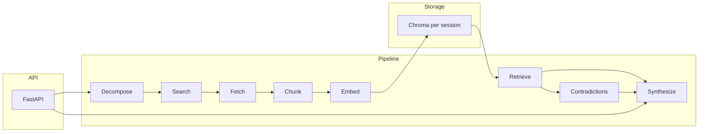

# Lumen architecture

## Overview

Lumen turns a natural-language research question into a short evidence-backed report. The data flow is linear with a feedback loop only at evaluation time (week 3).

## Components

### Pipeline

| Stage | Module | Role |
|-------|--------|------|
| Decompose | `pipeline/decompose.py` | Split the question into sub-queries (LLM JSON, or single query on Anthropic / missing client). |
| Search | `pipeline/search.py` | Tavily → Serper → deterministic demo URL if no API keys. |
| Fetch | `pipeline/fetch.py` | httpx GET + trafilatura extract; size-capped body. |
| Chunk | `pipeline/chunk.py` | Sliding window with overlap; stable `chunk_id` per URL. |
| Embed | `pipeline/embed.py` | OpenAI embeddings when `OPENAI_API_KEY` is set and `LUMEN_USE_MOCK_EMBEDDINGS=false`; otherwise deterministic mock vectors (1536-d) for local demos (e.g. DeepSeek-only chat). |
| Retrieve | `pipeline/retrieve.py` | Chroma cosine/L2 query; returns scored passages. |
| Contradictions | `pipeline/contradictions.py` | LLM JSON pass over passage pairs (skipped for Anthropic provider today). |
| Synthesize | `pipeline/synthesize.py` | Chat completion with citations; `iter_synthesize_report` streams deltas. |
| Orchestrate | `pipeline/orchestrator.py` | `_prepare` runs ingest; `run_research` / `iter_research_report_markdown` consume prepared passages. |

### Retrieval

`retrieval/chroma_store.py` wraps `chromadb.PersistentClient` under `CHROMA_PERSIST_DIRECTORY`. Each run uses `CHROMA_COLLECTION_PREFIX` + sanitized `session_id` as the collection name.

### API

`api/app.py` exposes:

- `GET /health` — liveness.
- `POST /api/v1/research` — full JSON result (`report_markdown`, `citations`, `contradictions`, `uncertainty_notes`).
- `POST /api/v1/research/stream` — NDJSON stream: `{"type":"meta",...}`, repeated `{"type":"token","text":"..."}`, then `{"type":"done"}`.

### Observability

LangSmith env vars are present in settings for week 3; pipeline stages do not yet emit traces.

## Failure modes

- **Search:** No keys → single demo hit (Python license doc); answers are toy-level unless Tavily/Serper is configured.
- **Fetch:** robots, TLS errors, or empty extraction → URL skipped; noted in `uncertainty_notes`.
- **Embeddings:** DeepSeek chat does not supply OpenAI embeddings — use `LUMEN_USE_MOCK_EMBEDDINGS=true` or set `OPENAI_API_KEY` for real vectors.
- **Chroma:** Empty collection after failed fetches → “No sources available…” response.
- **LLM:** `LUMEN_LLM_PROVIDER=anthropic` is not wired for chat in this vertical slice; use `openai` or `deepseek`.

## Cost and latency budget

Dominant costs: search API calls × sub-queries, fetched bytes, embedding token count, retrieval window size (`LUMEN_MAX_RETRIEVAL_CHUNKS`), and synthesis `max_tokens`. Tune `max_subqueries`, `_MAX_FETCH_URLS`, and `LUMEN_MAX_RETRIEVAL_CHUNKS` before production.

## Security boundaries

API keys never leave server env; session ids must be treated as untrusted strings (sanitized for collection names). Fetch layer should stay behind size limits and user-agent identification; week 4 should add auth on `/api/v1/*` and rate limits.
